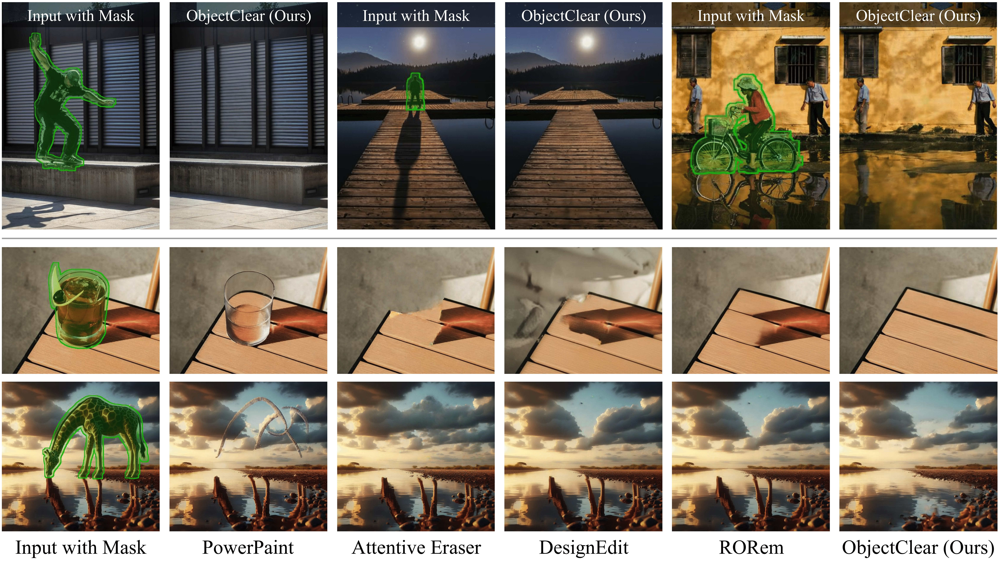
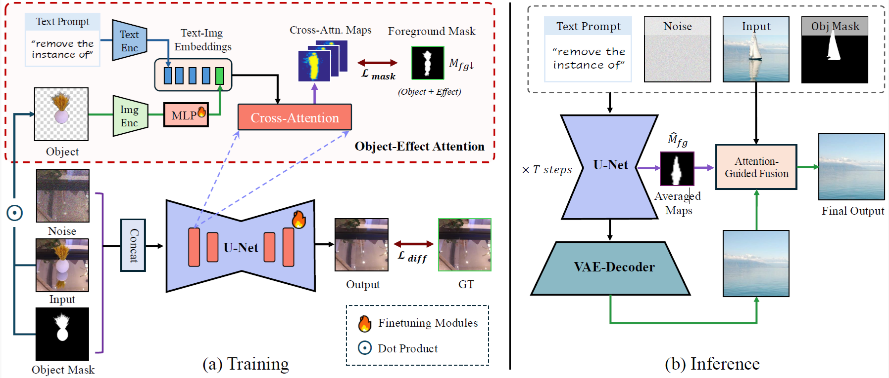
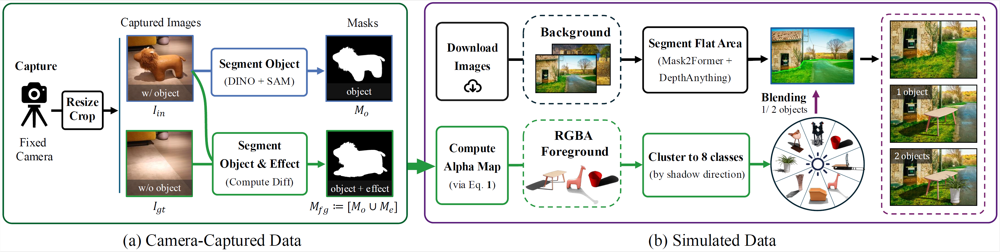
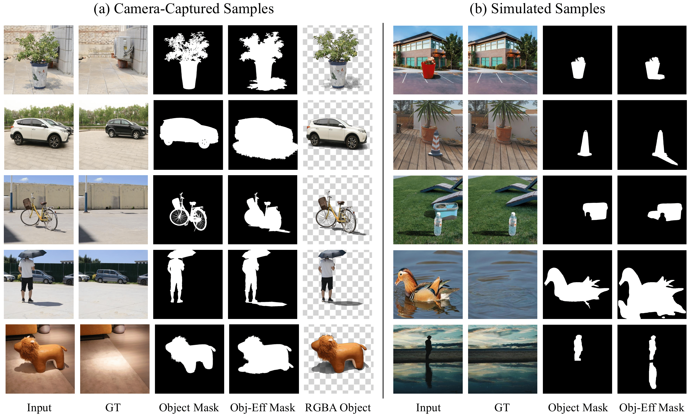

<div align="center">
<div style="text-align: center;">
    
    <h2>Complete Object Removal via Object-Effect Attention</h2>
</div>

<div>
    <a href="https://zjx0101.github.io/" target='_blank'>Jixin Zhao</a>&emsp;
    <a href='https://shangchenzhou.com/' target='_blank'>Shangchen Zhou<sup>†</sup></a>&emsp;
    <a href='https://wzhouxiff.github.io' target='_blank'>Zhouxia Wang</a>&emsp;
    <a href='https://pq-yang.github.io/' target='_blank'>Peiqing Yang</a>&emsp;
    <a href='https://www.mmlab-ntu.com/person/ccloy/' target='_blank'>Chen Change Loy</a>
</div>
<div>
    S-Lab, Nanyang Technological University<br>
   <p><sup>†</sup>Corresponding author</p>
</div>


<div>
    <h4 align="center">
        <a href="https://zjx0101.github.io/projects/ObjectClear/" target='_blank'>
        
        </a>
        <a href="https://arxiv.org/abs/2505.22636" target='_blank'>
        
        </a>
        <a href="https://huggingface.co/spaces/jixin0101/ObjectClear" target='_blank'>
        
        </a>
        
    </h4>
</div>

<strong>ObjectClear is an object removal model that can jointly eliminate the target object and its associated effects leveraging Object-Effect Attention, while preserving background consistency.</strong>

<div style="width: 100%; text-align: center; margin:auto;">
    
</div>

For more visual results, go checkout our <a href="https://zjx0101.github.io/projects/ObjectClear/" target="_blank">project page</a>

---
</div>

### 🔔 Dataset Release Plan 
**Thank you all for your interest in our dataset!** As the work is currently under review, we will not be releasing the datasets at this stage. We plan to make it publicly available once the paper is accepted. Please stay tuned for further updates! 🙂

## ⭐ Update
- [2025.07] Release the inference code and Gradio demo.
- [2025.05] This repo is created.

### ✅ TODO
- [ ] Release our datasets
- [ ] Adapt to ComfyUI
- [x] ~~Release the inference code and Gradio demo~~


## 🎃 Overview



## 📷 OBER Dataset


OBER (OBject-Effect Removal) is a hybrid dataset designed to support research in object removal with effects, combining both camera-captured and simulated data.




## ⚙️ Installation
1. Clone Repo
    ```bash
    git clone https://github.com/zjx0101/ObjectClear.git
    cd ObjectClear
    ```

2. Create Conda Environment and Install Dependencies
    ```bash
    # create new conda env
    conda create -n objectclear python=3.10 -y
    conda activate objectclear

    # install python dependencies
    pip3 install -r requirements.txt
    # [optional] install python dependencies for gradio demo
    pip3 install -r hugging_face/requirements.txt
    ```


## ⚡ Inference

### Quick Test
We provide some examples in the [`inputs`](./inputs) folder. **For each run, we take an image and its segmenatation mask as input.** <u>The segmentation mask can be obtained from interactive segmentation models such as [SAM2 demo](https://huggingface.co/spaces/fffiloni/SAM2-Image-Predictor)</u>. For example, the directory structure can be arranged as follows:
```
inputs
   ├─ imgs
   │   ├─ test-sample1.jpg      # .jpg, .png, .jpeg supported
   │   ├─ test-sample2.jpg
   └─ masks
       ├─ test-sample1.png
       ├─ test-sample2.png
```
Run the following command to try it out:

```shell
## Single image inference
python inference_objectclear.py -i inputs/imgs/test-sample1.jpg -m inputs/masks/test-sample1.png --use_fp16

## Batch inference on image folder
python inference_objectclear.py -i inputs/imgs -m inputs/masks --use_fp16
```


## 🪄 Interactive Demo
To get rid of the preparation for segmentation mask, we prepare a gradio demo on [hugging face](https://huggingface.co/spaces/jixin0101/ObjectClear) and could also [launch locally](./hugging_face). Just drop your image, assign the target masks with a few clicks, and get the object removal results!
```shell
cd hugging_face

# install python dependencies
pip3 install -r requirements.txt

# launch the demo
python app.py
```


## 📑 Citation
If you find our repo useful for your research, please consider citing our paper:

```bibtex
@InProceedings{zhao2025ObjectClear,
    title     = {{ObjectClear}: Complete Object Removal via Object-Effect Attention},
    author    = {Zhao, Jixin and Zhou, Shangchen and Wang, Zhouxia and Yang, Peiqing and Loy, Chen Change},
    booktitle = {arXiv preprint arXiv:2505.22636},
    year      = {2025}
    }
```

## 📝 License
The ObjectClear is made available for use, reproduction, and distribution strictly for non-commercial purposes. The code, models, and datasets are licensed under <a rel="license" href="./LICENSE">NTU S-Lab License 1.0</a>. Redistribution and use should follow this license.


## 📧 Contact
If you have any questions, please feel free to reach us at `jixinzhao0101@gmail.com`. 
